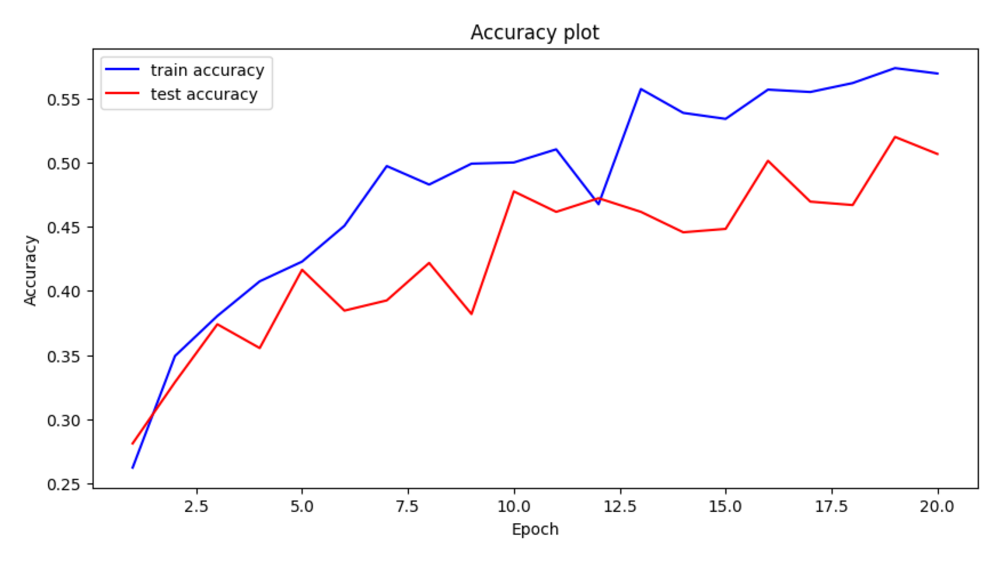
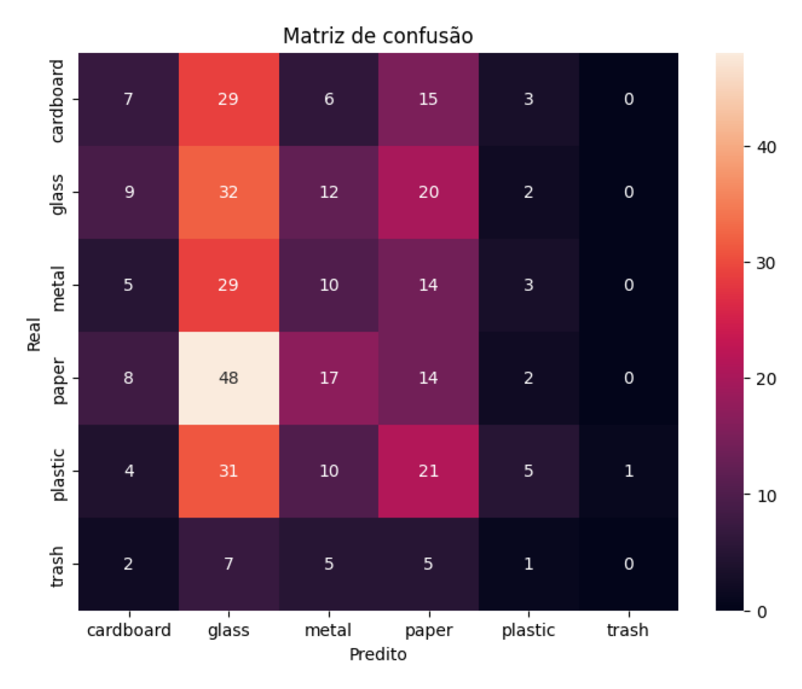

# Trabalho 2 – Redes Neurais

**Autores:** Kaio Cavalcante de Carvalho 33251230, Luis Henrique de Carvalho Ribeiro 22352930, Conceição Barbosa Rocha 22052987, Isaque, Jorge de Oliveira

[Trabalho2IA.ipynb - Abrir no Colab](https://colab.research.google.com/github/KaioCavalcante/TrabalhoIA2/blob/main/Trabalho2IA.ipynb)

## Classificação de Lixo para Reciclagem (TrashNet)

Este projeto implementa um classificador de imagens multiclasse utilizando Redes Neurais Convolucionais (CNN) para auxiliar no processo de triagem de resíduos recicláveis, um tema alinhado com os desafios atuais de sustentabilidade e foco da COP 30.  
O objetivo é classificar imagens de lixo em uma das seis categorias do dataset **TrashNet**:

- **glass** (vidro)  
- **paper** (papel)  
- **cardboard** (papelão)  
- **plastic** (plástico)  
- **metal** (metal)  
- **trash** (rejeito / lixo orgânico)

---

# Resultados

## Curva de Acurácia  
Mostra a evolução da acurácia de treino e teste ao longo das 20 épocas:

**Observações:**  
- Acurácia de treino estabiliza próximo de **0.57**  
- Acurácia de validação fica em torno de **0.51**  
- Indícios de leve overfitting, porém esperado em datasets pequenos

---

## Matriz de Confusão

A matriz abaixo mostra como o modelo acertou ou confundiu as classes:

### Principais observações:
- A classe **glass** foi a mais bem reconhecida (48 acertos)
- Classes como **trash** e **cardboard** têm mais confusões  
- As classes visualmente parecidas (ex.: *paper*, *plastic* e *cardboard*) geram mais erros

---

# Métricas

- **Acurácia de treino:** ~57%  
- **Acurácia de teste:** ~51%  
- **Percepção geral:** modelo inicial razoável para dataset pequeno  
- Data augmentation melhorou estabilidade do aprendizado  

---

# Conclusão

O uso de **data augmentation** ajudou o modelo a generalizar melhor os dados, evitando que ele aprendesse apenas exemplos específicos do treinamento. As transformações aplicadas aumentaram artificialmente a diversidade das imagens, reduzindo o risco de overfitting e tornando o modelo mais robusto.

No entanto, mesmo com essa técnica, o desempenho final ainda não foi alto, a acurácia permaneceu em torno de **51%** no conjunto de validação. Isso mostra que, apesar de contribuir positivamente, o data augmentation **não foi suficiente** para garantir boas classificações entre todas as classes, especialmente considerando o forte desbalanceamento do dataset TrashNet e a similaridade visual entre algumas categorias.

Assim, percebe-se que:

- O data augmentation **ajudou**, mas não resolveu totalmente o problema.  
- São necessários **mais dados**, especialmente para classes minoritárias.  
- Outras melhorias, como **transfer learning**, **aumento real do dataset**, **ajuste de hiperparâmetros** ou **modelos mais profundos**, podem levar a resultados mais precisos.

Em resumo: a técnica foi valiosa, mas não suficiente para atingir alta performance, sendo apenas um dos passos necessários para melhorar o classificador final.

